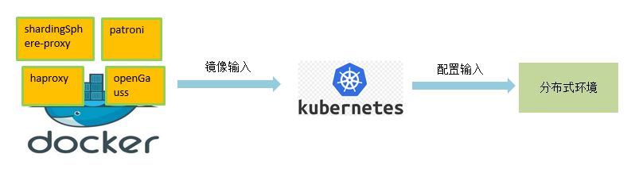

# openGauss-distributed-solutions

#### 介绍

使用K8S搭建openGauss分布式方案：由patroni、openGauss、etcd构成了数据库核心组件，提供数据库的容灾以及主备倒换等能力。使用ha-proxy管理数据库的主备关系；shardingsphere作为client，在集群部署完毕后，由shardingsphere根据分库分表规则，连接各个ha-proxy提供的服务ip，并将数据分布到各个分片。

#### 软件架构

#### 安装教程

K8S一键化部署脚本参照distributed下的 Kubernates环境部署说明.docx

#### 使用说明

1.  distributed：openGauss分布式搭建脚本
2.  docker-build：打包镜像
3.  patroni-for-openGauss：适配了openGauss的patroni，负责对openGauss数据库集群进行自动故障管理
4.  simple_install：K8S环境初始化脚本