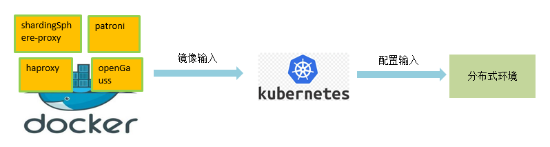

# openGauss-distributed-solutions

#### Introduction

You can set up a distributed openGauss solution using Kubernetes. Patroni, openGauss, and etcd are the core components of the database, offering features like disaster recovery and primary/standby switchover. HAProxy manages the primary/standby relationship. ShardingSphere acts as the client. Once the cluster is ready, ShardingSphere connects to the service IPs provided by each HAProxy and distributes data according to the sharding rules.

#### Software Architecture

#### Installation

For details about the one-click Kubernetes deployment script, see the Kubernetes environment deployment description in `distributed`.

#### Instruction

1.  distributed: The script for a distributed openGauss setup
2.  docker-build: Image packaging
3.  patroni-for-openGauss: Patroni adapted to openGauss, designed for automatic fault management of the openGauss database cluster
4.  simple_install: The Kubernetes environment initialization script
